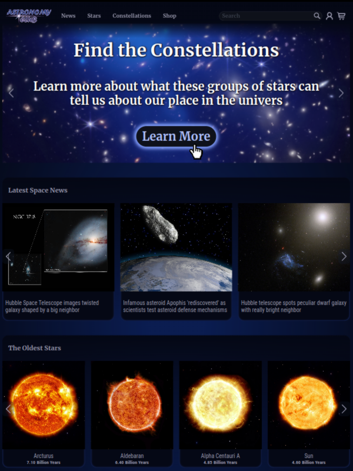
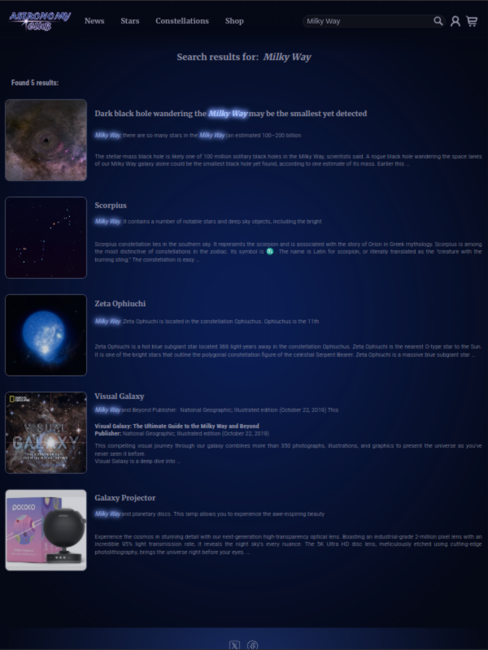
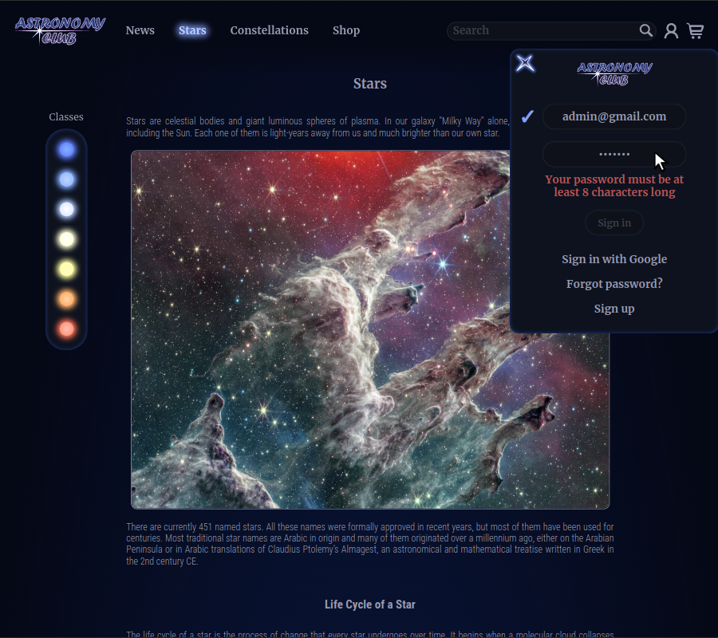
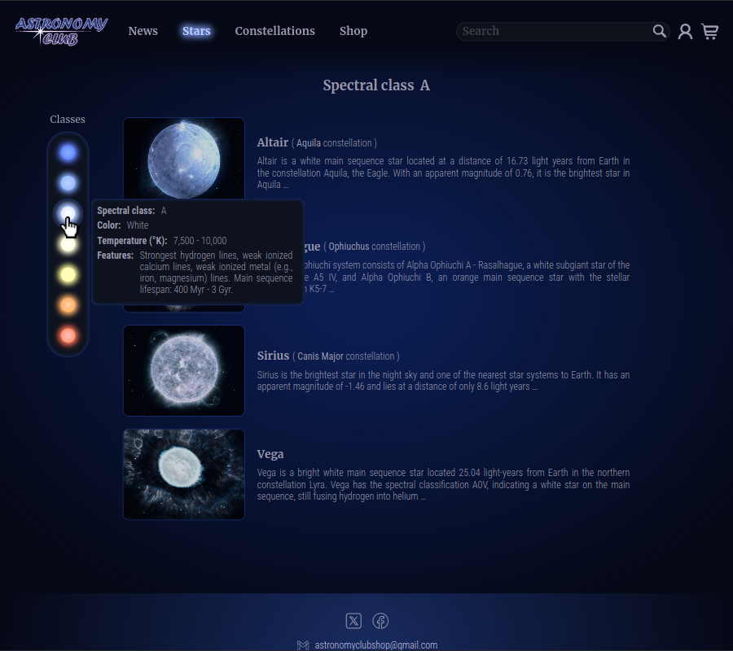
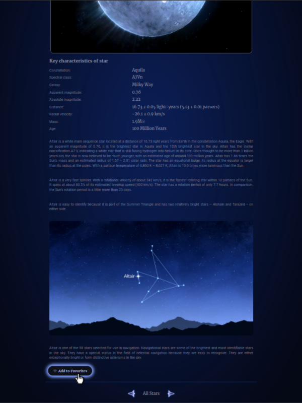
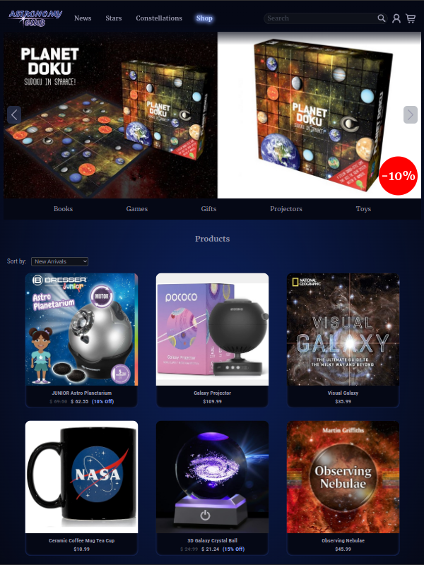
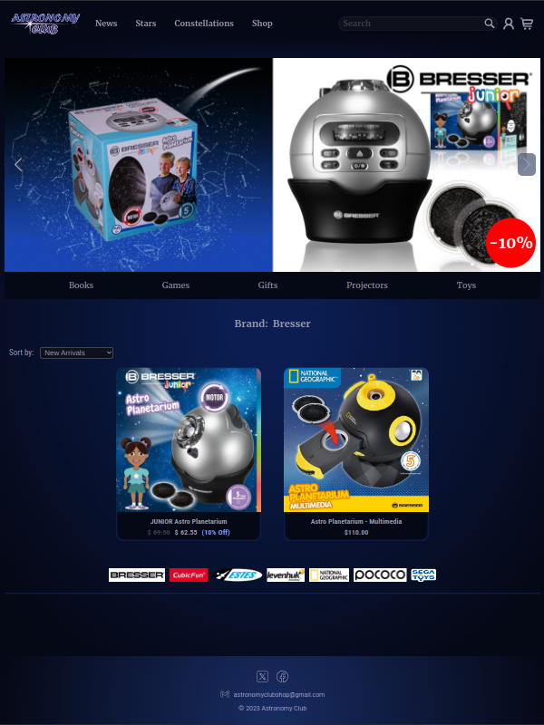
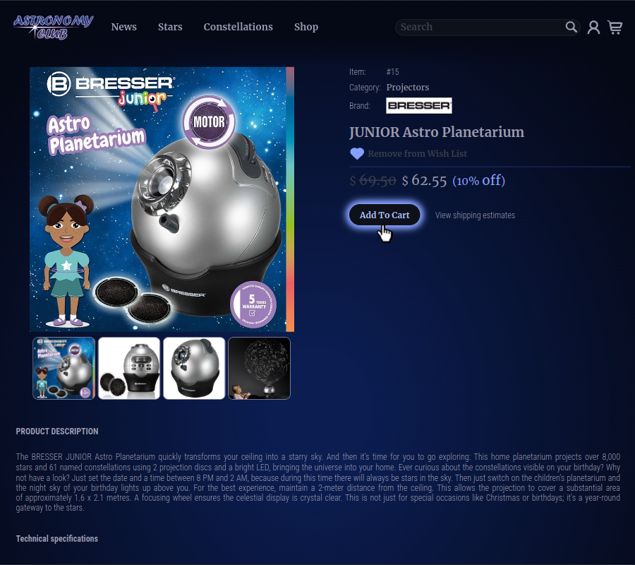
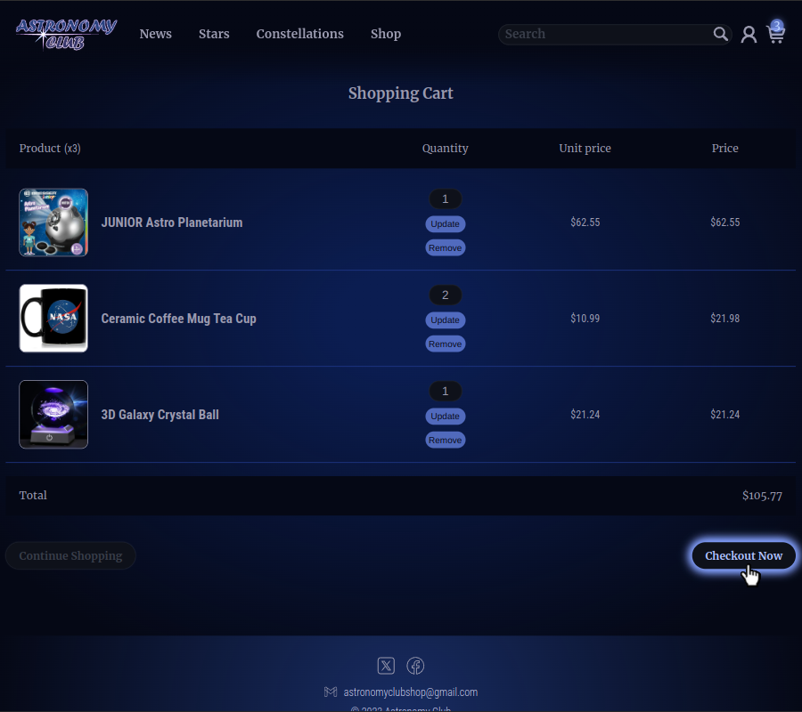

# Astronomy Club Project

The Astronomy Club Project is a Django-based web application designed to provide educational resources in astronomy for both children and adults. The project includes a range of functionalities such as user management, space news, detailed information on constellations and stars, and an online shop for astronomy-related products. Additionally, the application is optimized for mobile devices, ensuring a seamless user experience across various platforms. The project also includes comprehensive Django testing to ensure the reliability and stability of the application. 

This project aims to inspire and educate users about the wonders of the universe through an engaging and interactive platform.

## Technologies Used

- Python
- Django
- PostgreSQL
- HTML
- HTMX
- CSS
- JavaScript

## Screenshots

<p float="left">
  
  
</p>
<p float="left">
  
  
</p>
<p float="left">
  
  
  <!--  -->
</p>
<p float="left">
  
  
</p>

## Installation and Setup

### Prerequisites

- Docker and Docker Compose should be installed on your machine.
- Alternatively, PostgreSQL should be installed on your machine.

### Installation with Docker

1. Clone the repository:
    ```sh
    git clone https://github.com/Sergy1616/ac_project.git
    cd ac_project
    ```

2. Build the Docker images:
    ```sh
    docker-compose build
    ```

3. Start up the containers:
    ```sh
    docker-compose up
    ```

### Installation without Docker

1. Clone the repository:
    ```sh
    git clone https://github.com/Sergy1616/ac_project.git
    cd ac_project
    ```

2. Create a virtual environment:
    ```sh
    python -m venv .venv
    ```

3. Activate the virtual environment:   
    ```sh
    source .venv/bin/activate
    ```

4. Install dependencies:
    ```sh
    pip install -r requirements.txt
    ```

5. Update the database settings in `ac_app/app/settings.py`:
    ```python
    DATABASES = {
        'default': {
            'ENGINE': 'django.db.backends.postgresql',
            'NAME': 'your_db_name',
            'USER': 'postgres',
            'PASSWORD': '',
            'HOST': 'localhost',
            'PORT': '5432',
        }
    }
    ```

6. Create the database `your_db_name` and the USER in PostgreSQL (if necessary).

7. Connect to your database `your_db_name` and add the search extension:
    ```sh
    \c your_db_name
    CREATE EXTENSION pg_trgm;
    ```

8. Apply migrations:
    ```sh
    cd ac_app
    python manage.py migrate
    ```

9. Load data into the database:
    ```sh
    python manage.py loaddata ac_app_data.json 
    ```

10. Start the server:
    ```sh
    python manage.py runserver
    ```

11. Create a superuser if required:
    ```sh
    python manage.py createsuperuser
    ```
